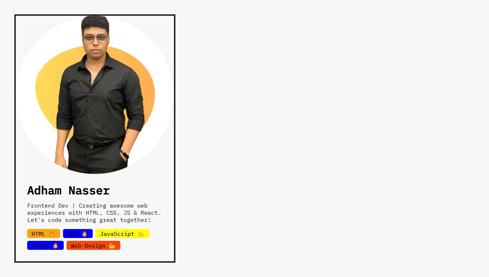

# Challenge 1: Building a Personal Portfolio Card

Welcome to **Challenge 1** of my learning journey! In this challenge, I've built a personal portfolio card using React. This project showcases my introductory information, skills, and a touch of creativity.

## Table of Contents

- [Introduction](#introduction)
- [Project Overview](#project-overview)
- [Learnings](#learnings)
- [Preview](#preview)

## Introduction

As part of my learning process, I took on this challenge to create a personal portfolio card using React. The goal was to display key details about myself, such as my name, a brief introduction, and a list of skills. The challenge aimed to consolidate my understanding of React components, JSX, and styling techniques.

## Project Overview

The project consists of several React components that come together to form the portfolio card:

- **Avatar**: Displays an avatar image to visually represent me.
- **Intro**: Presents my name and an introduction about my role as a frontend developer.
- **SkillList**: Lists a collection of skills with corresponding emojis and background colors.
- **Skill**: Displays individual skills with their names and emojis.

## Learnings

Through this challenge, I've gained the following insights and learned important concepts:

- **Component Composition**: I've practiced composing smaller components (`Avatar`, `Intro`, `SkillList`, and `Skill`) to build a larger UI structure (`App`).

- **JSX**: I've become more comfortable with JSX syntax, allowing me to seamlessly blend HTML-like code with JavaScript logic.

- **Props and Styling**: I've understood how to pass data through props to customize components and how to apply inline styling using React's `style` attribute.

- **Reusability**: The concept of creating reusable components has become clearer as I've created `Skill` components that display various skills with different properties.

## Preview

Here's a preview of how the personal portfolio card looks:

## What's Next

Completing this challenge has given me a taste of building interactive and dynamic components with React. I'm excited to continue refining my skills and taking on more complex projects that demonstrate my growth as a frontend developer.

Connect with me:
- GitHub: [Adham Nasser](https://github.com/Adham-XIII)
- LinkedIn: [Adham Nasser](https://www.linkedin.com/in/adham-nasser-xiii/)

Stay tuned for more challenges and projects in my learning journey! 🚀
