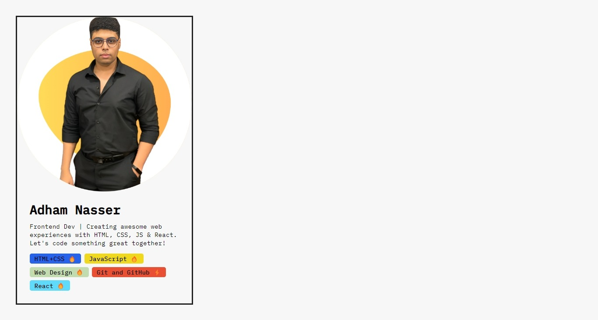

# Challenge 2: Elevating My Personal Portfolio

Welcome back to **Challenge 2** of my learning journey! In this challenge, I've taken my personal portfolio to the next level by introducing dynamic content and enhanced styling using React. This challenge builds upon the foundation laid in Challenge 1, enriching the portfolio card with more skills and interactivity.

## Table of Contents

- [Challenge 2: Elevating My Personal Portfolio](#challenge-2-elevating-my-personal-portfolio)
  - [Table of Contents](#table-of-contents)
  - [Introduction](#introduction)
  - [Project Overview](#project-overview)
  - [Learnings](#learnings)
  - [Preview](#preview)
  - [What's Next](#whats-next)

## Introduction

Building upon the previous challenge, I aimed to enhance my personal portfolio card using React's dynamic capabilities. In this challenge, I've incorporated a dynamic skill list, each with its own level and visual representation.

## Project Overview

The project structure remains consistent, but with the following key additions:

- **Skills Array**: I've defined an array of skills, each including the skill name, skill level, and a color code for styling.

- **SkillList Component**: I've modified the `SkillList` component to map over the skills array and render each skill using the `Skill` component.

- **Skill Component**: The `Skill` component now receives skill-related data as props and displays the skill name, level indicator, and background color based on the skill's color code.

## Learnings

This challenge has allowed me to deepen my understanding and skills in the following areas:

- **Data Mapping**: I've practiced mapping over data arrays to dynamically render components with varying content.

- **Conditional Rendering**: I've utilized conditional rendering to display level indicators based on the skill's proficiency level.

- **Color Styling**: I've explored using color codes to dynamically style components based on skill-related attributes.

- **Project Evolution**: This challenge showcases how a project can evolve by building upon a previously established foundation, enhancing functionality and aesthetics.

## Preview

Here's a glimpse of the elevated personal portfolio card:

## What's Next

By completing this challenge, I've further solidified my React skills and gained valuable experience in creating dynamic and visually appealing user interfaces. I'm excited to continue exploring more advanced concepts and tackling larger projects that continue to stretch my capabilities.

Connect with me:
- GitHub: [Adham Nasser](https://github.com/Adhamxiii)
- LinkedIn: [Adham Nasser](https://www.linkedin.com/in/adhamnasser/)

Stay tuned for more challenges and projects in my learning journey! 🚀
