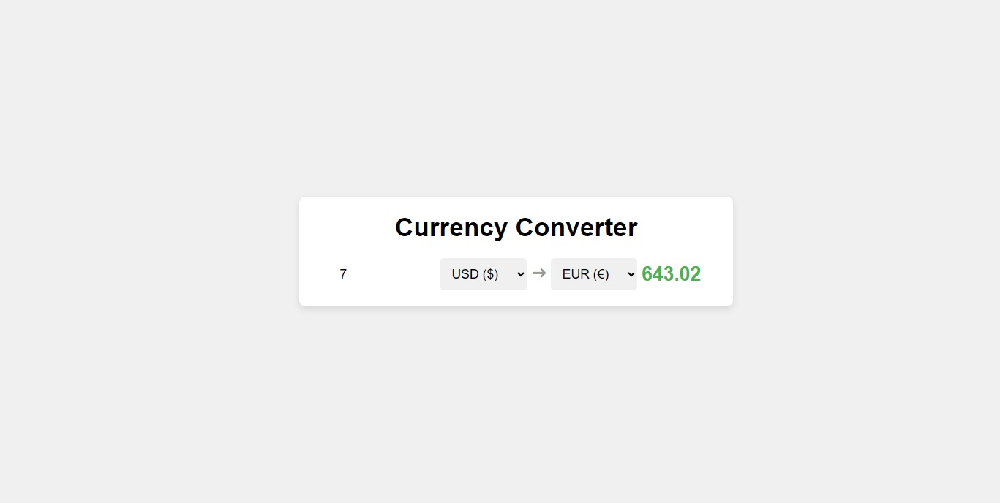

# Currency Converter App

The Currency Converter App is a simple web application built using React that allows users to convert currency values between different currencies. Users can input an amount, select the source currency (from) and the target currency (to), and the app will display the converted amount.

## Features

- Convert currency values between various currencies.
- Real-time currency conversion using the [Frankfurter API](https://www.frankfurter.app/).
- Dynamic updating of the converted amount upon input changes.
- User-friendly interface with selectable currencies.
- Loading indicator during currency conversion.

## Usage

1. Enter the amount you want to convert in the input field.
2. Select the source currency (from) from the first dropdown menu.
3. Select the target currency (to) from the second dropdown menu.
4. The converted amount will be displayed below the dropdowns. If the source and target currencies are the same, the converted amount will be the same as the input amount.

## Key Concepts Learned

- Building a React application using functional components and hooks.
- Making asynchronous API requests using the `fetch` function.
- Using the `useState` hook to manage state in functional components.
- Implementing dynamic UI updates based on user interactions.
- Creating a user-friendly interface with dropdown menus and input fields.
- Displaying loading indicators during API calls.
- Creating a simple currency converter logic based on exchange rates.

## Technologies Used

- [React](https://reactjs.org/) - A JavaScript library for building user interfaces.
- [Frankfurter API](https://www.frankfurter.app/) - A free and open exchange rates API.

Connect with me:

- GitHub: [Adham Nasser](https://github.com/Adhamxiii)
- LinkedIn: [Adham Nasser](https://www.linkedin.com/in/adhamnasser/)

Happy coding and happy learning!
