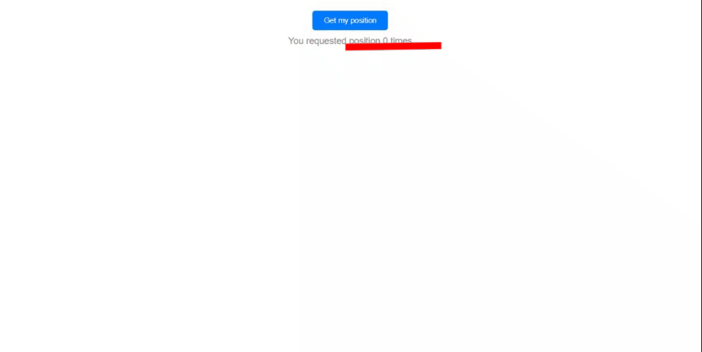

# Geolocation App

This is a simple React app that uses the Geolocation API to retrieve the user's GPS position and display it on a map.

## Table of Contents

- [Description](#description)
- [Demo](#demo)
- [Usage](#usage)
- [Components](#components)
- [Custom Hook: useGeolocation](#custom-hook-usegeolocation)
- [Connect with Me](#connect-with-me)

## Description

The Geolocation App demonstrates the usage of the Geolocation API to fetch the user's GPS coordinates (latitude and longitude) and display the coordinates on a map using OpenStreetMap. It also keeps track of the number of times the user requests their GPS position.

## Demo

Check out the live demo of the Geolocation App: 

## Usage

1. Open the app in your web browser.
2. Click the "Get my position" button to request your GPS position.
3. If your browser supports geolocation, your GPS coordinates will be displayed on the page, along with a link to view the location on OpenStreetMap.
4. The "You requested position" counter will keep track of the number of times you request your position.

## Components

The app consists of a single component named `App`. It utilizes the custom hook `useGeolocation` to handle geolocation functionality.

## Custom Hook: useGeolocation

The `useGeolocation` hook encapsulates the logic for fetching the user's GPS position using the Geolocation API. It provides the following values:

- `getPosition`: A function to initiate the geolocation request.
- `isLoading`: A boolean indicating whether the geolocation request is in progress.
- `position`: An object containing the latitude and longitude of the user's position.
- `error`: A string representing any errors that may occur during the geolocation request.

## Connect with Me

Feel free to connect with me as we explore more about React development and other exciting topics:

- GitHub: [Adham Nasser](https://github.com/Adham-XIII)
- LinkedIn: [Adham Nasser](https://www.linkedin.com/in/adham-nasser-xiii/)

Happy coding and happy learning! 🌍🚀
