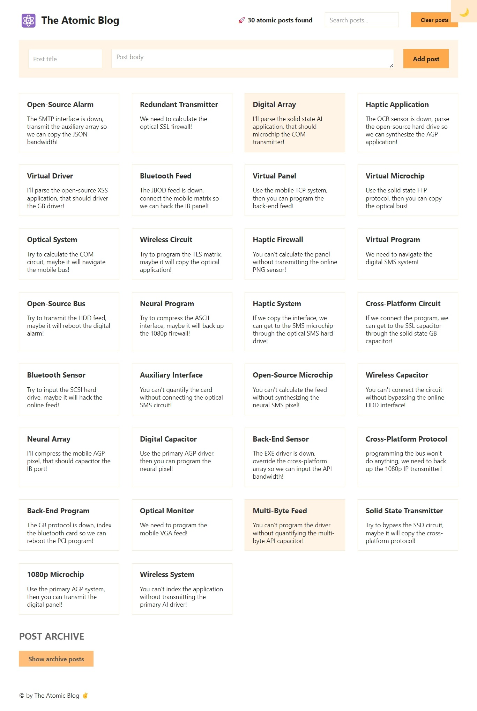
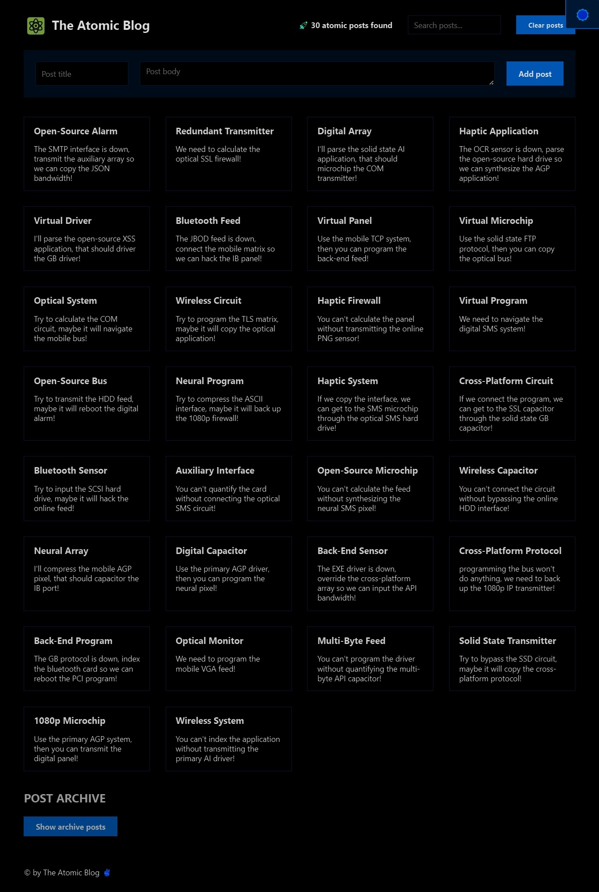

# Atomic Blog

This is the source code for the Atomic Blog, a React application that allows users to manage and view a list of blog posts. Users can add new posts, search for existing posts, and toggle between viewing current posts and archive posts.

## Table of Contents

- [Atomic Blog](#atomic-blog)
  - [Table of Contents](#table-of-contents)
  - [Description](#description)
  - [Features](#features)
  - [Screenshots](#screenshots)
  - [Components](#components)
  - [Lessons and Learnings](#lessons-and-learnings)

## Description

The Atomic Blog is a simple React application built to demonstrate various React concepts and features. It includes features such as adding new blog posts, searching for posts, and displaying archived posts. The application uses local state and derives state to manage and display the list of blog posts.

## Features

- Add new blog posts with titles and bodies.
- Search for existing blog posts.
- Toggle between viewing current posts and archive posts.
- Clear all posts.

## Screenshots

  
  

## Components

The application is organized into the following components:

- `Header`: The header component containing the title and search functionality.
- `Main`: The main content area for displaying and adding blog posts.
- `Footer`: The footer component displaying the copyright information.

## Lessons and Learnings

In this challenge, you'll gain insights into the following React concepts:

- Managing local state with `useState`.
- Handling form input and submission in React.
- Using derived state to filter and display blog posts.
- Component composition and organization.
- Toggling between different views in a React application.
- Utilizing React hooks like `useState` and `useEffect`.
- Understanding the context API and using the `useContext` hook for state management.

Connect with me:
- GitHub: [Adham Nasser](https://github.com/Adhamxiii)
- LinkedIn: [Adham Nasser](https://www.linkedin.com/in/adhamnasser/)

Stay tuned for more challenges and projects in my journey to master React development! 🚀