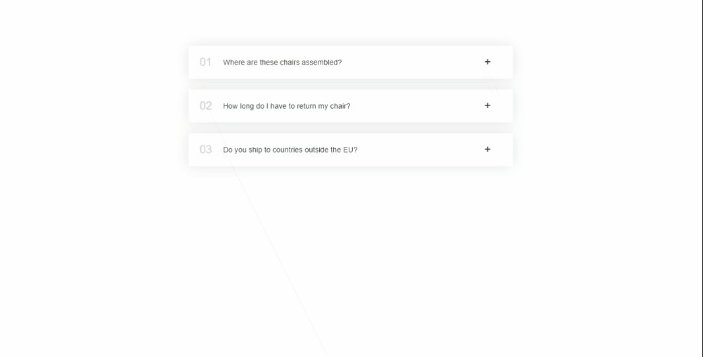

# FAQ Accordion App

Welcome to my FAQ Accordion App exercise! This repository showcases my progress in understanding React components and interactivity. In this exercise, I've built a simple FAQ accordion app using React, allowing users to interactively toggle and view frequently asked questions and their answers.

## Preview

## About This Exercise

In this exercise, I've focused on implementing the following concepts:

- **Component Structure:** I've divided the app into separate components for better organization and reusability.
- **State Management:** Utilizing the `useState` hook to manage the state of each accordion item, enabling dynamic expansion and collapse behavior.
- **Mapping Data:** Dynamically rendering multiple FAQ items by mapping through an array of data.
- **Conditional Rendering:** Displaying the answer text when an accordion item is open, and hiding it when the item is closed.
- **Event Handling:** Implementing click events to toggle the open/close state of each accordion item.

## How to Use

1. Clone this repository to your local machine.
2. Navigate to the project directory in your terminal.
3. Run `npm install` to install the required dependencies.
4. Run `npm start` to start the development server and view the FAQ Accordion App in your browser.

## Code Overview

- `App.js`: The main entry point of the application. Renders the `Accordion` component and passes the FAQ data to it.
- `Accordion.js`: The main container component responsible for rendering the individual `AccordionItem` components using data mapping.
- `AccordionItem.js`: Represents each FAQ item in the accordion. Manages the open/close state of the item and handles the click event.

## Stay Connected

Follow along with my progress and connect with me on my journey. Feel free to reach out, provide feedback, or suggest improvements. Let's learn and grow together!

Connect with me:

- GitHub: [Adham Nasser](https://github.com/Adham-XIII)
- LinkedIn: [Adham Nasser](https://www.linkedin.com/in/adham-nasser-xiii/)

Happy coding and happy learning!
