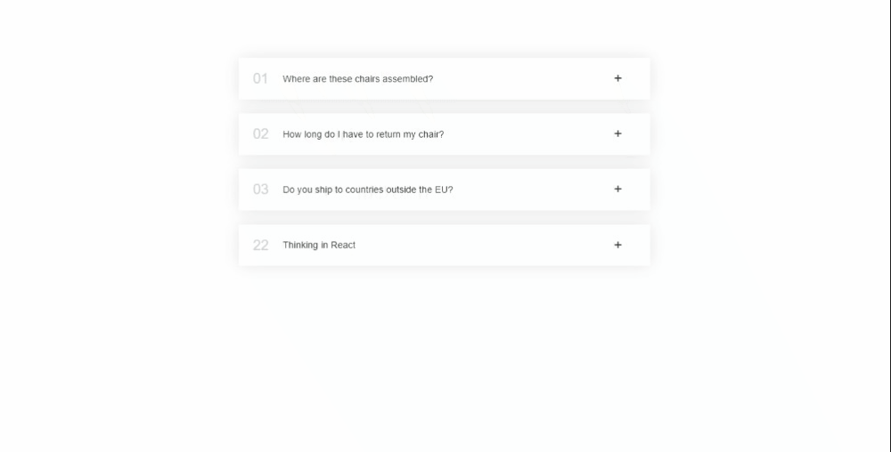

# Accordion Component - Version 2

## Description

This repository contains code for an Accordion component implemented using React. The Accordion component allows users to toggle and view content associated with each accordion item.

## Preview

Here's a preview of how the Accordion component looks when integrated into a web application:

## Code Overview

The code is structured as follows:

- `App.js`: The main component that renders the Accordion component with sample data.
- `Accordion.js`: The Accordion component that takes an array of data and displays the accordion items.
- `AccordionItem.js`: The individual accordion item component.

## Components

### Accordion

The `Accordion` component takes an array of data as a prop and renders the individual `AccordionItem` components.

### AccordionItem

The `AccordionItem` component displays an individual accordion item. It takes the following props:

- `num`: The item number.
- `title`: The title of the accordion item.
- `children`: The content to display when the item is expanded.
- `curOpen`: The currently open item's number.
- `onOpen`: A function to update the currently open item.

## Learning Points

Through this code, I learned the following:

- **Component Composition:** I understood how to compose components by nesting them within each other to build a complex UI element.
- **State Management:** I learned how to manage the open state of accordion items using the `useState` hook.
- **Props and Data Flow:** I grasped the concept of passing data and functions as props between parent and child components.
- **Conditional Rendering:** I used conditional rendering to display content based on the open/closed state of an item.

## Future Improvements

While this code is functional, there are several improvements that could be made:

- Adding animations to enhance the accordion item opening/closing transitions.
- Implementing accessibility features to ensure keyboard navigation and screen reader compatibility.
- Adding custom styling options to make the accordion component more flexible.

