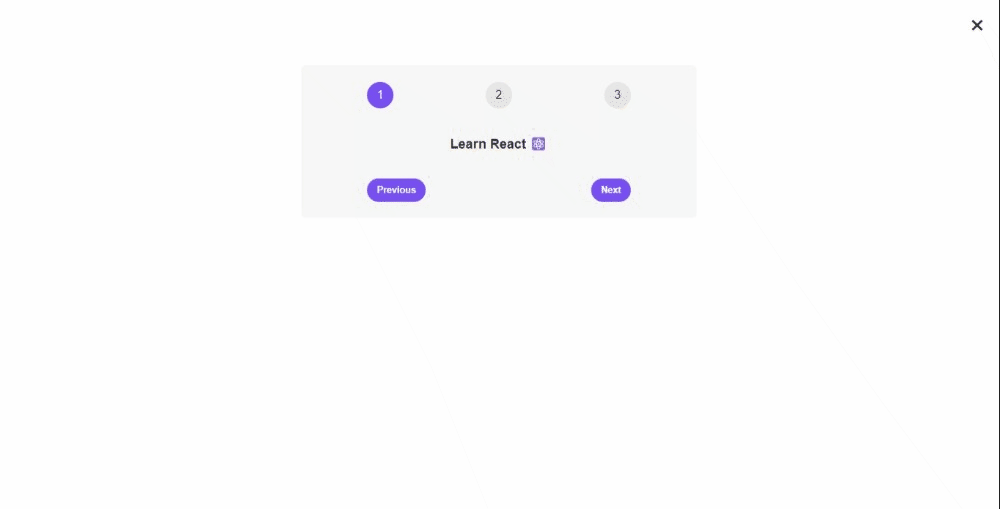

# Pre-Project Code: Steps and Messages App

Welcome to the README for my pre-project code that introduces the concept of managing steps and displaying messages using React. This simple app uses state management and conditional rendering to guide users through a sequence of messages.

## Table of Contents

- [Introduction](#introduction)
- [Project Overview](#project-overview)
- [Learnings](#learnings)
- [Preview](#preview)

## Introduction

In this pre-project code, I've developed a React application that presents a set of messages in sequential order. Users can navigate through the messages using the "Previous" and "Next" buttons. Additionally, there is an option to toggle the visibility of the steps and messages container.

## Project Overview

The app consists of the following key components:

- **App**: The main component that manages the current step, visibility state, and handles the navigation buttons' logic.

## Learnings

Through this pre-project exercise, I've gained the following insights and learned important concepts:

- **State Management**: I've utilized React's `useState` hook to manage state variables, including the current step and the visibility of the message container.

- **Conditional Rendering**: I've implemented conditional rendering to show or hide the message container based on the `isOpen` state.

- **Event Handling**: I've practiced event handling by associating functions with button clicks to navigate between steps and toggle the message container's visibility.

## Preview

Here's a visual preview of the pre-project app:

## What's Next

This pre-project exercise has introduced me to fundamental concepts in React, including state management and conditional rendering. I'm excited to build upon these concepts and tackle more complex projects that demonstrate my growing proficiency in React development.

Connect with me:
- GitHub: [Adham Nasser](https://github.com/Adham-XIII)
- LinkedIn: [Adham Nasser](https://www.linkedin.com/in/adham-nasser-xiii/)

Stay tuned for more projects and practical applications of React in my learning journey! 🚀
