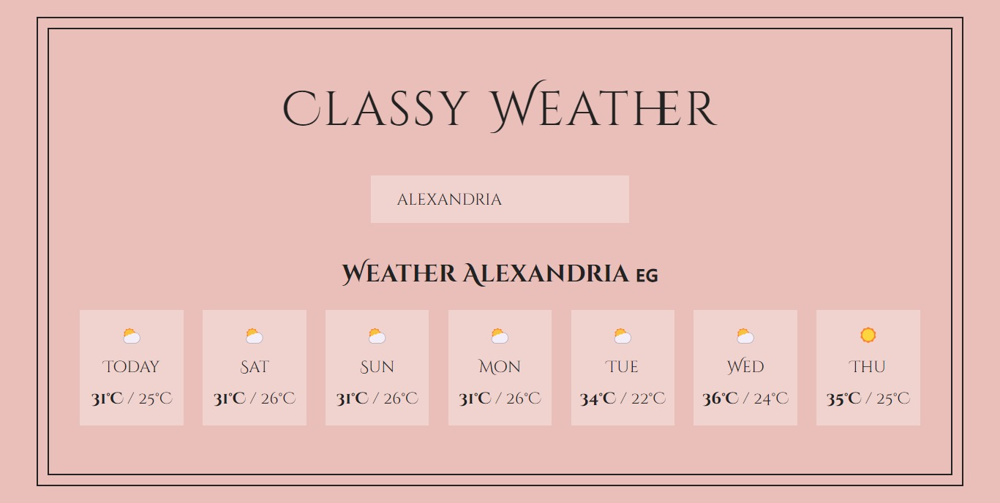

# Classy Weather

**Classy Weather** is a weather application built using React. It allows users to search for weather forecasts based on location names. The app displays a stylish weather icon, temperature, and weather conditions for multiple days.

## Table of Contents

- [Classy Weather](#classy-weather)
  - [Table of Contents](#table-of-contents)
  - [Description](#description)
  - [Features](#features)
  - [Live Demo](#live-demo)
  - [Usage](#usage)
  - [Components](#components)
  - [Installation](#installation)
  - [How It Works](#how-it-works)
  - [Contributing](#contributing)
  - [Connect with Me](#connect-with-me)

## Description

**Classy Weather** is designed to provide users with weather forecasts in a visually appealing and user-friendly way. It fetches weather data from the Open Meteo API based on the location entered by the user.

## Features

- **Search by Location**: Users can enter the name of a location to get its weather forecast.

- **Sleek UI**: The app presents weather information in an elegant and stylish manner, including weather icons.

- **Multiple Days Forecast**: Users can see the weather forecast for multiple days, including today's weather.

## Live Demo

You can try the live demo of **Classy Weather** [here](https://weatherverse-00.web.app/).

## Usage

1. Open the **Classy Weather** app in your web browser.

2. In the search bar, enter the name of the location you want to check the weather for.

3. Press the "Get Weather" button to fetch and display the weather information.

4. You will see the weather conditions, including an icon, maximum and minimum temperatures, and the day of the week, for multiple days.

## Components

The **Classy Weather** app consists of the following components:

- **App**: The main component that manages the state and renders other components.

- **Input**: A component responsible for taking user input (location).

- **Weather**: Displays weather information, including the weather icon, temperature, and day of the week.

- **Day**: Represents a single day's weather information.

## Installation

To run the **Classy Weather** app locally, follow these steps:

1. Clone this repository to your local machine using `git clone`.

2. Navigate to the project directory.

3. Run `npm install` to install the project dependencies.

4. Run `npm start` to start the development server.

5. Open your web browser and go to `http://localhost:3000` to use the app locally.

## How It Works

**Classy Weather** fetches weather data from the Open Meteo API. Here's how it works:

- When a user enters a location name and clicks the "Get Weather" button, the app sends a request to a geocoding API to get the latitude and longitude of the location.

- With the latitude and longitude, the app then sends a request to the Open Meteo API to fetch the weather forecast for that location.

- The weather data is displayed in a user-friendly format, including weather icons, temperatures, and day of the week.

## Contributing

If you'd like to contribute to **Classy Weather**, please follow these steps:

1. Fork this repository.

2. Create a new branch for your feature or bug fix.

3. Make your changes and commit them.

4. Push your changes to your forked repository.

5. Submit a pull request to this repository, detailing your changes.

6. Your pull request will be reviewed, and your changes may be merged into the main project.

## Connect with Me

Feel free to connect with me as we continue to explore the exciting world of React development:

- GitHub: [Adham Nasser](https://github.com/Adhamxiii)
- LinkedIn: [Adham Nasser](https://www.linkedin.com/in/adhamnasser/)

Happy coding and happy learning! 🚀
