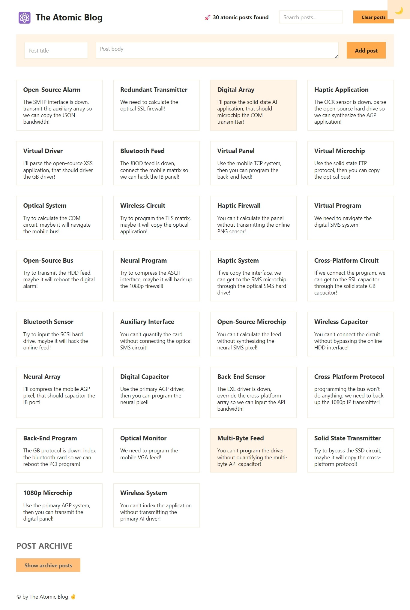
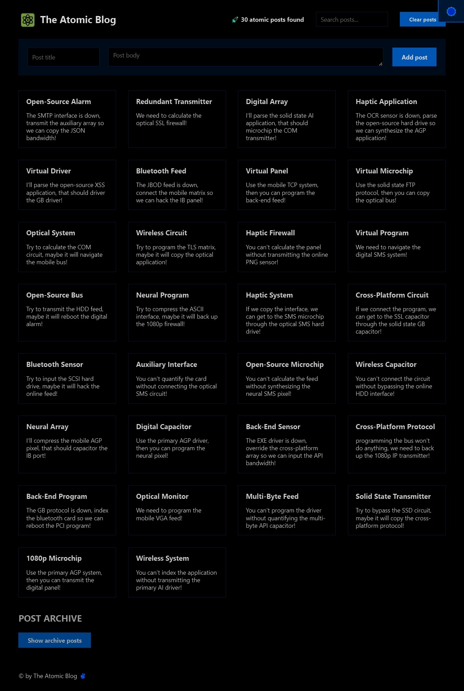

# Atomic Blog

This is the source code for the Atomic Blog, a React application built to demonstrate various React concepts learned in Lesson 8. The project covers topics such as context management, state management, and component composition.

## Table of Contents

- [Description](#description)
- [Features](#features)
- [Screenshots](#screenshots)
- [Components](#components)
- [Lessons and Learnings](#lessons-and-learnings)
- [How to Run](#how-to-run)
- [Contributing](#contributing)

## Description

The Atomic Blog project is part of Lesson 8 and focuses on understanding context management and state in React. It demonstrates how to manage and share application-level state using the Context API and useContext hook.

## Features

- Display a list of blog posts.
- Add new blog posts.
- Search for specific blog posts.
- Toggle between viewing all posts and searched posts.

## Screenshots

  
  

## Components

The application is organized into the following components:

- `Header`: The header component containing the title and search functionality.
- `Main`: The main content area for displaying and adding blog posts.
- `Footer`: The footer component displaying the copyright information.
- `Archive`: An additional component to display an archive of posts.

## Lessons and Learnings

In this project, you'll gain insights into the following React concepts:

- Managing local state with `useState`.
- Handling form input and submission in React.
- Using the Context API for state management.
- Utilizing the `useContext` hook to access shared state.
- Derived state for filtering and displaying blog posts.
- Component composition and organization in a React application.

## How to Run

To run this project locally, follow these steps:

1. Clone the repository to your local machine.
2. Navigate to the project directory.
3. Install dependencies using `npm install` or `yarn install`.
4. Start the development server with `npm start` or `yarn start`.

The application will be accessible at `http://localhost:3000` in your web browser.

## Contributing

Contributions are welcome! If you'd like to contribute to this project, please follow these guidelines:

1. Fork the repository.
2. Create a new branch for your feature or bug fix.
3. Make your changes and test them thoroughly.
4. Create a pull request with a clear description of your changes.

Connect with me:
- GitHub: [Adham Nasser](https://github.com/Adham-XIII)
- LinkedIn: [Adham Nasser](https://www.linkedin.com/in/adham-nasser-xiii/)

Stay tuned for more challenges and projects in my journey to master React development! 🚀