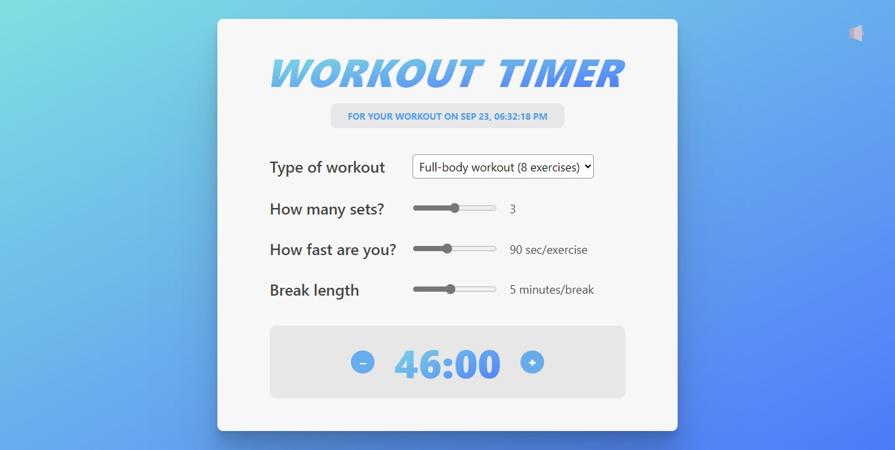

# Workout Timer App

## Overview

The Workout Timer App is a React-based web application designed to assist users in timing their workouts. It offers an intuitive interface for configuring workout settings, including exercise type, set count, exercise speed, and break duration. Additionally, users can enable or disable sound notifications to stay on track during their workouts.

## Features

- **Customizable Workout Settings:** Choose your workout type, set count, exercise speed, and break duration.
- **Real-time Countdown:** The app displays the remaining workout time in minutes and seconds.
- **Sound Notifications:** Toggle sound notifications on or off for workout reminders.
- **Dynamic Workout Options:** The available workout choices adapt based on whether it's morning (AM) or evening (PM).

## Usage

1. Upon launching the Workout Timer App, the current time and workout settings will be displayed.

2. To customize your workout:
   - Select the "Type of workout" from the dropdown menu.
   - Adjust the "How many sets?" slider to specify the set count.
   - Use the "How fast are you?" slider to set exercise speed.
   - Set the "Break length" slider to determine the duration of breaks between sets.

3. The app calculates and shows the total workout duration in minutes and seconds.

4. Toggle sound notifications on or off using the 🔈/🔇 button.

5. Click the "+" and "–" buttons to increase or decrease the workout duration.

6. Start your workout when ready, and the app provides real-time countdown updates.

## Preview

Here's a glimpse of what the Workout Timer App looks like:

## Lessons and Learnings

Throughout the development of the Workout Timer App (Challenge 12), I acquired valuable insights and skills, including:

- **Routing and Single-Page Applications (SPAs):** I implemented React Router for navigation, creating a seamless single-page application.

- **CSS Modules:** CSS Modules were employed to style components, preventing class name conflicts.

- **Dynamic Routes With URL Parameters:** Dynamic routes enabled users to access workouts with specific parameters via the URL.

- **Programmatic Navigation with useNavigate:** The `useNavigate` hook facilitated programmatic navigation between different app sections.

- **Context API:** I utilized the Context API for efficient state management and data sharing among components.

## Contributing

Contributions to improve this app are welcome! If you have any ideas for new features or improvements, please open an issue or submit a pull request.

Connect with me:

- GitHub: [Adham Nasser](https://github.com/Adhamxiii)
- Linkedin: [Adham Nasser](https://www.linkedin.com/in/adhamnasser/)

Happy coding and happy learning! 🌍🚀
