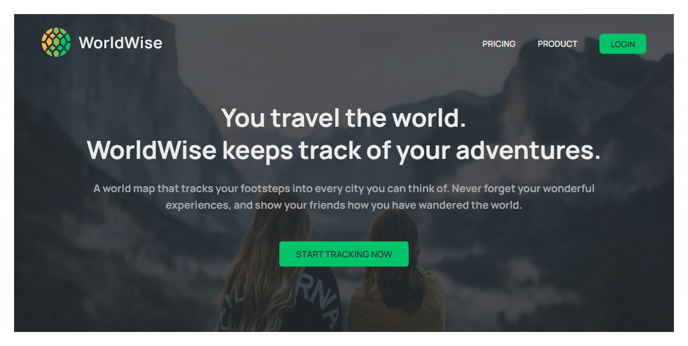
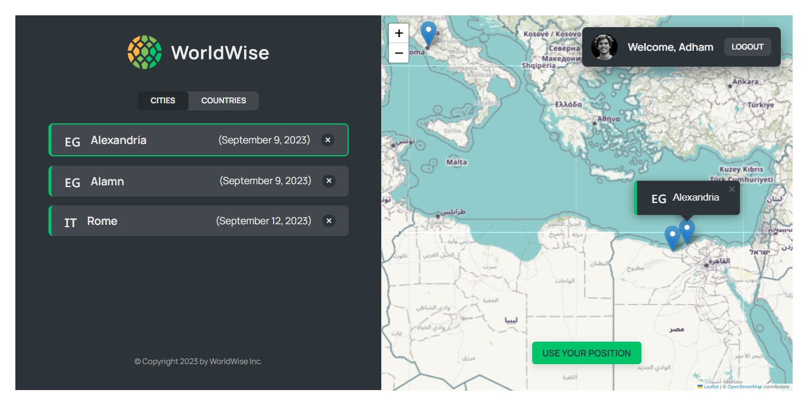

# WorldWise

WorldWise is a web application that allows you to track your adventures around the world. It provides a user-friendly interface to mark cities you've visited, add notes, and explore your travel history on an interactive map.

## Table of Contents

- [WorldWise](#worldwise)
  - [Table of Contents](#table-of-contents)
  - [Demo](#demo)
  - [Features](#features)
  - [Usage](#usage)
  - [Screenshots](#screenshots)
  - [Technologies Used](#technologies-used)
  - [Lessons and Learnings](#lessons-and-learnings)
  - [Contributing](#contributing)

## Demo

## Features

- Interactive map for tracking visited cities.
- Add and edit notes for each city.
- User authentication for data privacy.
- Explore pricing and product information.
- Simple and intuitive user interface.

## Usage

1. **Login or Create an Account:** To start tracking your adventures, you can either log in with your existing account or create a new one.

2. **Interactive Map:** Explore the interactive map and click on cities you've visited to add them to your travel history.

3. **Add Notes:** After clicking on a city, you can add notes and details about your visit.

4. **View Statistics:** Check out statistics about your travels, including visited countries and cities.

5. **Logout:** You can log out of your account anytime to protect your data.

## Screenshots

## Technologies Used

- React.js
- React Router
- React Leaflet (for maps)
- CSS Modules
- Node.js (for the backend, if applicable)
- [Other technologies you used]

## Lessons and Learnings

During the development of WorldWise, I acquired valuable insights and knowledge in several key areas:

- **Routing and Single-Page Applications (SPAs):** I gained a deep understanding of how routing works in a single-page application (SPA) using React Router. SPAs offer a smooth user experience by loading content dynamically without full page refreshes.

- **CSS Modules:** I leveraged CSS Modules to encapsulate styles, making it easier to manage and avoid naming conflicts in my project. CSS Modules improved the maintainability of my stylesheets.

- **Nested Routes and Index Route:** Implementing nested routes allowed me to structure my application logically. With an index route as the parent, I could organize related routes and components efficiently.

- **Dynamic Routes With URL Parameters:** I learned how to create dynamic routes that adapt to URL parameters. This feature was crucial for displaying city details and handling user interactions.

- **Programmatic Navigation with `useNavigate`:** I discovered the power of programmatic navigation with the `useNavigate` hook. This allowed me to navigate users to specific pages within the application based on actions and events.

- **Context API:** The Context API was instrumental in managing global state and user authentication. It provided a seamless way to share data across components without prop drilling.

These lessons and learnings not only improved the development of WorldWise but also enhanced my overall understanding of React-based web applications. I'm excited to apply this knowledge to future projects.

## Contributing

Contributions to improve this app are welcome! If you have any ideas for new features or improvements, please open an issue or submit a pull request.

Connect with me:

- GitHub: [Adham Nasser](https://github.com/Adhamxiii)
- Linkedin: [Adham Nasser](https://www.linkedin.com/in/adhamnasser/)

Happy coding and happy learning! 🌍🚀
