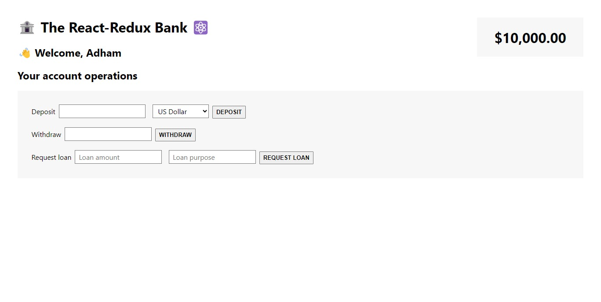

# React-Redux Bank

## Table of Contents

- [React-Redux Bank](#react-redux-bank)
  - [Table of Contents](#table-of-contents)
  - [Description](#description)
  - [Features](#features)
  - [Prerequisites](#prerequisites)
  - [Usage](#usage)
  - [Technologies Used](#technologies-used)
  - [Lessons and Learnings](#lessons-and-learnings)
  - [Contributing](#contributing)

## Description

The React-Redux Bank is a simple web application that allows users to create a customer account, perform various account operations, and view their account balance. This application demonstrates the use of React with Redux for state management in a banking context.

## Features

- Create a new customer account.
- Deposit funds into the account.
- Withdraw funds from the account.
- Request a loan with a specified purpose.
- Pay back an existing loan.
- Display the account balance in real-time.

## Prerequisites

Before you begin, ensure you have met the following requirements:

- Node.js and npm installed on your development machine.
- Basic understanding of React and Redux concepts.

## Usage

1. Upon launching the application, you will be greeted with the main page of the React-Redux Bank.

2. If you are a new customer, click on the "Create Customer" button to create your customer account. Enter your full name and national ID.

3. Once you have created an account, you can perform various account operations:
   - **Deposit**: Enter the amount you wish to deposit and select your currency. Click the "Deposit" button.
   - **Withdraw**: Enter the amount you wish to withdraw and click the "Withdraw" button.
   - **Request Loan**: Enter the loan amount and purpose, then click the "Request Loan" button.
   - **Pay Loan**: If you have an outstanding loan, you can click the "Pay Loan" button to repay it.

4. Your account balance is displayed at the bottom of the page.

5. You can also toggle the sound on and off using the sound button in the top-right corner.

## Technologies Used

- React: A JavaScript library for building user interfaces.
- Redux: A predictable state container for managing application state.
- Redux Toolkit: An official package for efficient Redux development.
- React-Redux: Official React bindings for Redux.
- Node.js: A JavaScript runtime for server-side development.
- npm: A package manager for JavaScript.
- HTML and CSS: For structuring and styling the application.

## Lessons and Learnings

Throughout the development of this application, several key lessons and learnings were acquired:

- Effective use of Redux for state management in a complex application.
- Creation and management of Redux actions, reducers, and store.
- Building reusable React components for user interface elements.
- Integration of external APIs for currency conversion.
- Asynchronous actions and handling loading states.
- React-Redux best practices for connecting components to the store.

## Contributing

Contributions to improve this app are welcome! If you have any ideas for new features or improvements, please open an issue or submit a pull request.

Connect with me:

- GitHub: [Adham Nasser](https://github.com/Adhamxiii)
- Linkedin: [Adham Nasser](https://www.linkedin.com/in/adhamnasser/)

Happy coding and happy learning! 🌍🚀
