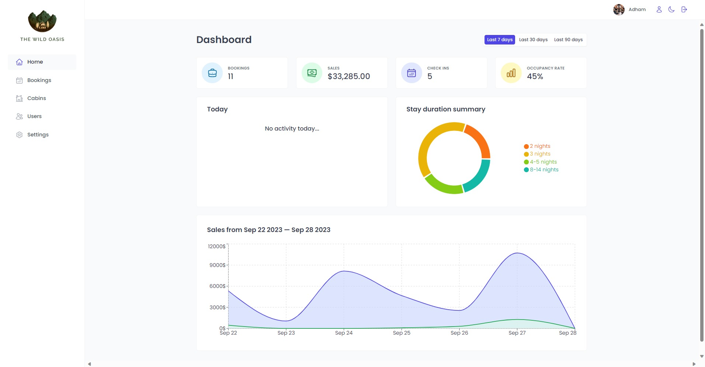

# The Wild Oasis - React Application

## Table of Contents

- [The Wild Oasis - React Application](#the-wild-oasis---react-application)
  - [Table of Contents](#table-of-contents)
  - [Description](#description)
  - [Features](#features)
  - [Prerequisites](#prerequisites)
  - [Usage](#usage)
  - [Project Structure](#project-structure)
  - [Technologies Used](#technologies-used)
  - [Live Demo](#live-demo)
---

## Description

**The Wild Oasis** is a modern React application designed to manage bookings and cabins for a wilderness retreat. This project serves as a comprehensive example of building a robust web application using React and various technologies. You'll learn how to create and manage components, handle user authentication, fetch and display data, and much more.

In this lesson, you'll explore the following key topics:

- Creating React Components and organizing them effectively.
- Implementing user authentication, including sign-up, login, and logout features.
- Fetching data from external APIs (Supabase) and displaying it in your React components.
- Handling form submissions and validation.
- Styling your application using CSS-in-JS (Styled Components).
- Implementing error handling with user-friendly error messages.
- Managing file uploads, including image uploads to cloud storage.
- Utilizing React Context for global application settings like dark mode.
- Efficient data fetching, caching, and background data synchronization with `react-query`.
- Implementing navigation guards to restrict access based on user authentication status.

---

## Features

- User Authentication: Sign up, log in, and log out securely.
- Dashboard: Get an overview of recent bookings and retreat activities.
- Bookings Management: Create, update, and delete bookings.
- Cabins Management: Manage wilderness cabins, including images.
- User Profile: Update user data and settings.
- Dark Mode: Switch between light and dark modes for a personalized experience.
- Responsive Design: Enjoy a user-friendly interface on various devices.

---

## Prerequisites

Before you begin, ensure you have the following prerequisites:

- Node.js and npm (Node Package Manager) installed on your development machine.
- A code editor of your choice (e.g., Visual Studio Code).
- Basic knowledge of JavaScript and React.

---

## Usage

Follow these guidelines to use the application effectively:

- Sign up or log in to access the full functionality of the application.
- Explore the different pages, including the dashboard, bookings, cabins, users, settings, and account.
- Use the navigation menu to switch between pages.
- Update your user profile and settings as needed.
- Create, update, and delete bookings and cabins.
- Enjoy the responsive and user-friendly interface of the application.

---

## Project Structure

The project follows a structured organization:

- `src/` contains the application source code, including components, pages, and hooks.
- `styles/` contains the global and component-specific CSS-in-JS styles.
- `services/` includes functions to interact with external services (e.g., Supabase).
- `context/` contains the React Context for managing global state.
- `utils/` houses utility functions and constants used throughout the project.
- `ui/` includes reusable UI components and styles.
- `pages/` defines the application routes and page components.

---

## Technologies Used

**The Wild Oasis** project leverages the following technologies:

- React
- React Router (react-router-dom)
- Supabase
- react-query
- Styled Components
- HTML/CSS
- JavaScript/ES6

---

## Live Demo

Check out the live demo of **The Wild Oasis** [here](https://wildoasis00.netlify.app/).

---

Connect with me:

- GitHub: [Adham Nasser](https://github.com/Adham-XIII)
- Linkedin: [Adham Nasser](https://www.linkedin.com/in/adham-nasser-xiii/)

Happy coding and happy learning! 🌍🚀
