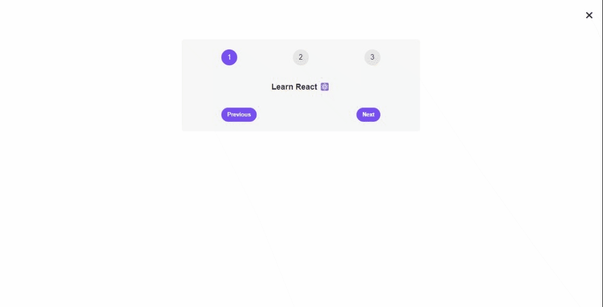

# My Journey to Learn React

Welcome to my journey of learning React! This repository documents my progress, projects, and lessons as I embark on a quest to master React web development. Join me in exploring the fascinating world of building dynamic and interactive user interfaces.

## About Me

I'm [Adham Nasser](https://github.com/Adham-XIII), a passionate learner and aspiring React developer. With a background in JavaScript, I'm excited to dive into the world of web development and create impactful user experiences. Follow along with my journey to see how I tackle challenges, build projects, and improve my React skills.

## About This Repository

This repository serves as a central hub for my React learning journey. Here's what you can expect to find:

## Table of Contents

- [Lessons and Projects](#lessons-and-projects)
- [Exercises](#exercises)
- [Challenges](#challenges)
- [Stay Connected](#stay-connected)

## Lessons and Projects

### Lesson 1: Building a Pizza Menu App

- **Directory**: [Lessons-n-Projects/01-pizza-menu/](./Lessons-n-Projects/01-pizza-menu/)
- **Summary**: In this first lesson, I've built a Pizza Menu App using React. I've covered the foundational concepts of React, including:
  - Creating components as building blocks.
  - Utilizing JSX to define UI elements.
  - Incorporating JavaScript logic in components.
  - Managing state and conditional rendering.
  - Passing and receiving props between components.
  - Rendering lists of items dynamically.
  - Using React fragments for cleaner DOM rendering.
  - Applying conditional styling and text content.
- **Concepts Learned**:
  - Creating functional components and class components.
  - Writing JSX to define the user interface.
  - Implementing state management.
  - Conditional rendering based on state.
  - Passing data between parent and child components using props.
  - Dynamically rendering lists.
  - Using React fragments.
  - Applying conditional styling and text content.

### Lesson 2: Pre-Project Code - Steps and Messages App

- **Directory**: [Lessons-n-Projects/02-steps/](./Lessons-n-Projects/02-steps/)
- **Summary**: Welcome to the README for my pre-project code that introduces the concept of managing steps and displaying messages using React. This simple app uses state management and conditional rendering to guide users through a sequence of messages.
- **Concepts Learned**:
  - State Management using `useState` hook.
  - Conditional Rendering based on state.
  - Event Handling for button clicks.
- **Preview**: Here's a visual preview of the pre-project app:

[Read more](./Lessons-n-Projects/02-steps/README.md)

### Lesson 3: Building a Packing List App

- **Directory**: [Lessons-n-Projects/03-travel-list/](./Lessons-n-Projects/03-travel-list/)
- **Summary**: Welcome to **Far Away** Travel List! In this app, I've built a Packing List App that demonstrates fundamental concepts in frontend development using React. This app allows users to create a list of items they need for a trip, mark items as packed, and view helpful stats about their packing progress.
- **Concepts Learned**:
  - State Management using `useState` hook.
  - Component communication through props.
  - Conditional rendering for dynamic content.
  - Usage of React fragments.
  - Applying dynamic styling.
  - Array manipulation methods (`map`, `filter`, `sort`) for effective data management.
- **Live Demo**: Check out the live demo of the app: [Packing List App](https://travel-list-00.web.app/)

[Read more](Lessons-n-Projects/03-travel-list/README.md)

Stay tuned for more challenges, projects, and lessons as I continue my journey to master React development!

### Lesson 4: Splitwise - Friends Expense Management App

- **Directory**: [Lessons-n-Projects/04-eat-n-split/](./Lessons-n-Projects/04-eat-n-split/)
- **Summary**: Welcome to the **Splitwise** Friends Expense Management App! This app allows you to manage expenses among friends by adding new friends, selecting them, and splitting bills easily. By engaging with this project, I've gained valuable insights into state management, conditional rendering, event handling, and component communication in a React application.
- **Concepts Learned**:
  - State management within components.
  - Component composition for modularity.
  - Conditional rendering techniques.
  - Event handling for user interactions.
  - Facilitating component communication.
- **Live Demo**: Check out the live demo of the app: [Splitwise - Friends Expense Management App](https://splitwise-00.web.app/)

[Read more](Lessons-n-Projects/04-eat-n-split/README.md)

Stay tuned as I continue to explore more advanced concepts and build exciting projects in my journey to master React development!

### Lesson 5: Understanding React Rendering and Key Concepts

- **Directory**: [Lessons-n-Projects/05-how-react-works/](./Lessons-n-Projects/05-how-react-works/)
- **Summary**: In this lesson, I delved into the inner workings of React's rendering process and learned about key concepts that influence how components are rendered, updated, and interact with the user. Key concepts include the render phase, diffing algorithm, key prop, pure components, state update batching, event handling, and React's role in the web development ecosystem.
- **Concepts Learned**:
  - Overview of React's rendering process.
  - How the render phase works.
  - Understanding the diffing algorithm.
  - The importance of the `key` prop for efficient reconciliation.
  - Pure components and render optimization.
  - State update batching for performance.
  - Event handling in React.
  - React's place in the web development ecosystem.
  - React's inner workings behind the scenes.
- **Applying Knowledge**: I applied my knowledge by building a Tabbed Component using React, which allows users to switch between tabs, revealing different content and demonstrating the rendering process and event handling in action.

[Read more](Lessons-n-Projects/05-how-react-works/README.md)

### Lesson 6: Movie Search App

- **Directory**: [Lessons-n-Projects/06-usepopcorn/](./Lessons-n-Projects/06-usepopcorn/)
- **Summary**: This is the source code for a Movie Search App built using React. The app allows users to search for movies, view details about them, and manage their watched movie list.
- **Concepts Learned**:
  - State management using React's `useState` hook.
  - Lifting state to parent components.
  - Creating and using custom hooks for code reuse.
  - Event handling and component communication.
- **Live Demo**: Check out the live demo of the Movie Search App: [Live Demo](https://cinematease-00.web.app/)

[Read more](Lessons-n-Projects/06-usepopcorn/README.md)

### Stay Tuned

As I progress on my journey to master React development, I look forward to exploring more advanced concepts and building exciting projects. Stay tuned for more lessons and practical applications of React!

### Lesson 7: Classy Weather

- **Directory**: [Lessons-n-Projects/07-classy-weather/](./Lessons-n-Projects/07-classy-weather/)
- **Summary**: **Classy Weather** is a weather application built using React. It allows users to search for weather forecasts based on location names and displays weather information in a visually appealing and user-friendly way.
- **Concepts Learned**:
  - Fetching data from external APIs.
  - Displaying data in an elegant UI.
  - Component architecture and state management.
- **Live Demo**: You can try the live demo of **Classy Weather** [here](https://weatherverse-00.web.app/).

[Read more](Lessons-n-Projects/07-classy-weather/README.md)

### Next Steps

This lesson has significantly contributed to my growing expertise in React development. It enhanced my skills in component-based architecture, state management, and data handling. As I continue my journey, I'm excited to tackle more challenges, explore advanced concepts, and build even more engaging and interactive applications using React.

### Lesson 8: React Quiz App

- **Directory**: [Lessons-n-Projects/08-react-quiz/](./Lessons-n-Projects/08-react-quiz/)
- **Summary**: This is a React Quiz App that allows users to test their knowledge with a series of questions. Users can answer questions and receive a score based on their performance.
- **Concepts Learned**:
  - React component architecture.
  - State management in React.
  - Fetching data using the `fetch` API.
  - Using the `useReducer` hook for organized state management.
  - Timer implementation for time-limited questions.
  - Conditional rendering based on app state.
- **Live Demo**: You can try out the live demo of the React Quiz App [here](https://reactquizmaster.web.app/).

[Read more](Lessons-n-Projects/08-react-quiz/README.md)

### Lesson 9: Atomic Blog

- **Directory**: [Lessons-n-Projects/09-atomic-blog/](./Lessons-n-Projects/09-atomic-blog/)
- **Summary**: This is the source code for the Atomic Blog, a React application built to demonstrate various React concepts learned in Lesson 8. The project covers topics such as context management, state management, and component composition.
- **Concepts Learned**:
  - Managing local state with `useState`.
  - Handling form input and submission in React.
  - Using the Context API for state management.
  - Utilizing the `useContext` hook to access shared state.
  - Derived state for filtering and displaying blog posts.
  - Component composition and organization in a React application.
- **Screenshots**:  

[Read more](Lessons-n-Projects/09-atomic-blog/README.md)

### Lesson 10: Workout Timer App

- **Directory**: [Lessons-n-Projects/10-workout-timer/](./Lessons-n-Projects/10-workout-timer/)
- **Summary**: The Workout Timer App is a React-based web application designed to assist users in timing their workouts. It offers an intuitive interface for configuring workout settings, including exercise type, set count, exercise speed, and break duration. Additionally, users can enable or disable sound notifications to stay on track during their workouts.
- **Concepts Learned**:
  - Implementing React Router for navigation in single-page applications (SPAs).
  - Using CSS Modules for component styling to prevent class name conflicts.
  - Creating dynamic routes with URL parameters.
  - Utilizing the `useNavigate` hook for programmatic navigation.
  - Implementing the Context API for efficient state management and data sharing among components.
- **Preview**: 

[Read more](Lessons-n-Projects/10-workout-timer/README.md)

### Lesson 11: WorldWise

- **Directory**: [Lessons-n-Projects/11-worldwise/](./Lessons-n-Projects/11-worldwise/)
- **Summary**: WorldWise is a web application that allows you to track your adventures around the world. It provides a user-friendly interface to mark cities you've visited, add notes, and explore your travel history on an interactive map.
- **Concepts Learned**:
  - Deep understanding of routing and single-page applications (SPAs) using React Router.
  - Use of CSS Modules for encapsulating styles and improving maintainability.
  - Implementation of nested routes and index routes for efficient component organization.
  - Creation of dynamic routes with URL parameters.
  - Utilization of programmatic navigation with the `useNavigate` hook.
  - Effective use of the Context API for managing global state and user authentication.

[Read more](Lessons-n-Projects/11-worldwise/README.md)

### Lesson 12: React-Redux Bank

- **Directory**: [Lessons-n-Projects/12-redux-intro/](./Lessons-n-Projects/12-redux-intro/)
- **Summary**: React-Redux Bank is a simple web application that allows users to create a customer account, perform various account operations, and view their account balance. This application demonstrates the use of React with Redux for state management in a banking context.
- **Features**:
  - Creating a new customer account.
  - Depositing funds into the account.
  - Withdrawing funds from the account.
  - Requesting a loan with a specified purpose.
  - Paying back an existing loan.
  - Displaying the account balance in real-time.
- **Prerequisites**: Node.js and npm installed on your development machine, basic understanding of React and Redux concepts.

[Read more](Lessons-n-Projects/12-redux-intro/README.md)

### Lesson 13: Fast React Pizza Co. - Online Pizza Ordering System

- **Directory**: [Lessons-n-Projects/13-fast-react-pizza/](./Lessons-n-Projects/13-fast-react-pizza/)
- **Summary**: Fast React Pizza Co. is a web-based pizza ordering system built with React, Redux, and Node.js. This application allows users to browse a menu of delicious pizzas, customize their orders, and place them online for delivery or pickup. It also includes user authentication, real-time order tracking, and geolocation-based address retrieval.
- **Concepts Learned**:
  - Building a responsive user interface with React components.
  - Managing global state and asynchronous actions using Redux.
  - Implementing user authentication and authorization.
  - Integrating third-party APIs for geolocation.
  - Handling real-time updates and tracking with web sockets.
  - Deploying a full-stack application to a production server.
- **Preview**: 

[Read more](./Lessons-n-Projects/13-fast-react-pizza/README.md)

### Lesson 14: The Wild Oasis - React Application

- **Directory**: [Lessons-n-Projects/14-the-wild-oasis/](./Lessons-n-Projects/14-the-wild-oasis/)
- **Summary**: **The Wild Oasis** is a modern React application designed to manage bookings and cabins for a wilderness retreat. This project serves as a comprehensive example of building a robust web application using React and various technologies. You'll learn how to create and manage components, handle user authentication, fetch and display data, and much more.
- **Concepts Learned**:
  - Creating React Components and organizing them effectively.
  - Implementing user authentication, including sign-up, login, and logout features.
  - Fetching data from external APIs (Supabase) and displaying it in your React components.
  - Handling form submissions and validation.
  - Styling your application using CSS-in-JS (Styled Components).
  - Implementing error handling with user-friendly error messages.
  - Managing file uploads, including image uploads to cloud storage.
  - Utilizing React Context for global application settings like dark mode.
  - Efficient data fetching, caching, and background data synchronization with `react-query`.
  - Implementing navigation guards to restrict access based on user authentication status.
- **Preview**: 

[Read more](Lessons-n-Projects/14-the-wild-oasis/README.md)

## Exercises

### Exercise 01: Flash Cards with React

Welcome to the README for my Flash Cards exercise using React. This exercise focuses on building a simple interactive flash cards application that toggles between displaying questions and answers upon clicking on each card. The exercise highlights the use of state management, conditional rendering, and event handling within a React application.

[**View Exercise README**](./Exercise/exercise-01/README.md)

### Exercise 02: FAQ Accordion App

Welcome to my FAQ Accordion App exercise! This repository showcases my progress in understanding React components and interactivity. In this exercise, I've built a simple FAQ accordion app using React, allowing users to interactively toggle and view frequently asked questions and their answers.

[**View Exercise README**](./Exercise/exercise-02/README.md)

### Exercise 03: Accordion Component - Version 2

This repository contains code for an Accordion component implemented using React. The Accordion component allows users to toggle and view content associated with each accordion item.

[**View Exercise README**](./Exercise/exercise-03/README.md)

### Exercise 04: Higher-Order Components (HOC) Exercise

In this exercise, we explore Higher-Order Components (HOC) in React to enhance the functionality of components. We apply HOC to create a toggling feature for displaying limited items initially and expanding to show all items when needed.

[**View Exercise README**](./Exercise/exercise-04/README.md)

### Exercise 05: Compound Component Pattern

In this exercise, we explore the Compound Component Pattern using React. The Compound Component Pattern allows us to build components that work together seamlessly while providing a flexible and intuitive API for consuming these components.

[**View Exercise README**](./Exercise/exercise-05/README.md)

## Challenges

Throughout my journey of learning React, I've taken on various challenges to apply my knowledge and build interesting projects. Here are the challenges I've completed so far:

1. [Challenge 1: Building a Personal Portfolio Card](./Challenges/challenge-01/README.md) - In this challenge, I created a personal portfolio card using React, showcasing my introductory information, skills, and a touch of creativity.

2. [Challenge 2: Elevating My Personal Portfolio](./Challenges/challenge-02/README.md) - Building upon my portfolio card, I introduced dynamic content and enhanced styling using React, enriching the user experience.

3. [Challenge 3: Building a Dynamic Date Counter](./Challenges/challenge-03/README.md) - In this challenge, I built a dynamic date counter using React, focusing on state management, event handling, and date calculations.

4. [Challenge 4: Building Another Dynamic Date Counter](./Challenges/challenge-04/README.md) - In this challenge, I continued my exploration of dynamic date counters with React, further improving my state management and event handling skills.

5. [Challenge 5: Tip Calculator App](./Challenges/challenge-05/README.md) - I built a Tip Calculator App using React, allowing users to calculate tips based on bill amount and service satisfaction percentages.

6. [Challenge 6: Text Expander Component](./Challenges/challenge-06/README.md) - I created a Text Expander Component that enables users to collapse and expand text content efficiently.

7. [Challenge 7: Currency Converter App](./Challenges/challenge-07/README.md) - I built a Currency Converter App using React, allowing users to convert currency values between different currencies.

8. [Challenge 8: Geolocation App](./Challenges/challenge-08/README.md) - I developed a Geolocation App that retrieves the user's GPS position and displays it on a map using the Geolocation API.

9. [Challenge 9: Banking App](./Challenges/challenge-09/README.md) - I created a simple Banking App using React and state management with the `useReducer` hook. This app simulates basic banking operations like opening an account, depositing money, withdrawing money, requesting loans, paying off loans, and closing the account.

10. [Challenge 10: Atomic Blog](./Challenges/challenge-10/README.md) - The Atomic Blog is a React application that allows users to manage and view a list of blog posts, demonstrating various React concepts such as managing local state, form handling, and component composition.

11. [Challenge 11: Refactoring with Context API](./Challenges/challenge-11/README.md) - In this challenge, I refactored an existing React application using the Context API to improve state management and data flow.

## Stay Connected

Follow along with my progress and connect with me on my journey. Feel free to reach out, provide feedback, or suggest improvements. Let's learn and grow together!

Connect with me:

- GitHub: [Adham Nasser](https://github.com/Adham-XIII)
- Linkedin: [Adham Nasser](https://www.linkedin.com/in/adham-nasser-xiii/)

Thank you for joining me on my React learning journey! Happy coding! 🚀
